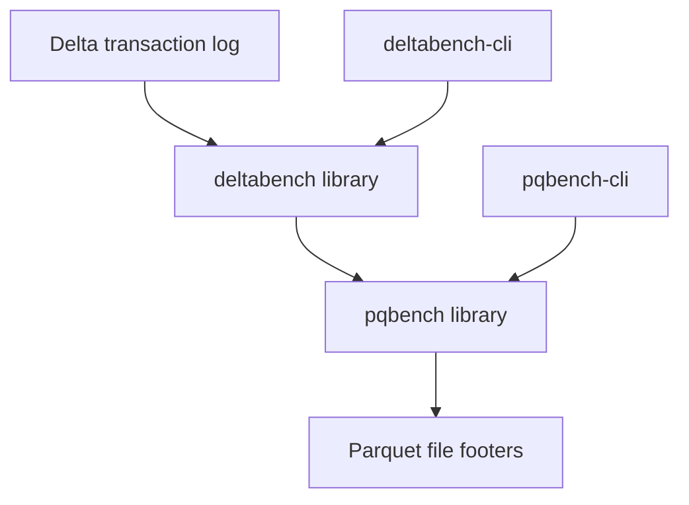

# pqbench

*lzbench for parquet.*

`pqbench` is a small command-line tool for measuring parquet (and raw file)
compression behavior: how well each codec compresses a file's bytes, how fast it
compresses/decompresses them, and how big each column is on disk. It is
dependency-light, reads only what it needs, and keeps measurement separate from
presentation so its output can be fed to other tools.

The workspace also contains `deltabench`, a higher-level tool that resolves a
Delta Lake snapshot and orchestrates `pqbench` footer analysis across its active
Parquet files. Delta, Arrow, and async storage dependencies remain outside the
low-level `pqbench` crates.



`pqbench` reads metadata from individual Parquet files. `deltabench` uses
delta-rs to select a table snapshot, passes each active file to `pqbench`, and
aggregates the results. The two CLI crates only parse arguments and render their
respective library results.

## Build

```
cargo build --release
```

Build the Delta tool separately:

```
cargo build --release --package deltabench-cli
```

The Delta crates require Rust 1.91.1 or newer, matching delta-rs 0.32.4. The
default `pqbench` workspace members retain their existing toolchain support.

For development, prefer `cargo check` and normal debug builds. Release builds
perform substantially more optimization and should be reserved for benchmarks
and release artifacts.

The repository automatically uses [`sccache`](https://github.com/mozilla/sccache)
when it is available and falls back to `rustc` when it is not. Install it once:

```
cargo install sccache
```

No global Cargo configuration is required. Check reuse and cache size with:

```
make cache-stats
```

The development profile keeps incremental compilation enabled for fast rebuilds
of workspace crates and reduces debug information to improve compile and link
times. `sccache` mainly helps with non-incremental dependency compilation. To
share its cache across worktrees, set `SCCACHE_DIR` to the same absolute
directory in each shell.

The gate is `make check` (`cargo fmt --check`, `clippy -D warnings`, and the
test suite). `make samples` fetches a few open parquet datasets into
`data/samples/` for manual testing.

## Commands

```
pqbench <COMMAND> [OPTIONS]
```

### lz

lzbench-style compression benchmark over raw file bytes:

```
pqbench lz file.bin -c zstd@3 --samples 10
```

Sweeps every wired codec (gzip, lz4, snappy, zstd) over the file at each level,
reporting the compression ratio and throughput in megabytes per second. Use
`-c codec@level` to restrict the sweep and `--mode`/`--samples`/`--warmup-iterations`
to tune the measurement.

### compression

The same sweep over the encoded pages of a **NONE-compressed** parquet file:

```
pqbench compression data.parquet --per-column
```

`--per-column` adds a per-column breakdown. This command decodes the page
payloads and re-compresses them, so the input must be uncompressed (NONE).

### bytemass

Per-column byte masses — how many on-disk bytes each column takes per row:

```
pqbench bytemass data.parquet
```

This reads **only the parquet footer metadata**, so it works on any file
regardless of column compression and never loads the pages into memory.

- `--json` — emit the byte-mass tree as composable `{name, value, children}` JSON
  for a downstream tool.
- `--d3` — emit a self-contained HTML page that renders the masses as a treemap
  (d3 imported as ES modules from a CDN):

```
pqbench bytemass data.parquet --d3 > treemap.html && xdg-open treemap.html
```

### Local Delta tables

`deltabench` analyzes the latest snapshot, or an explicit version, by reading
only the active Parquet files' footer metadata:

```
deltabench ./table
deltabench ./table --version 42 --json
deltabench ./table --d3 > treemap.html
```

The report describes physical storage: active file bytes, physical Parquet rows,
compressed and uncompressed column bytes, codecs, and compressed bytes per row.
It excludes the Delta log and tombstoned files. The current local implementation
rejects deletion vectors, column mapping, external data paths, and active files
whose size differs from the transaction log.
