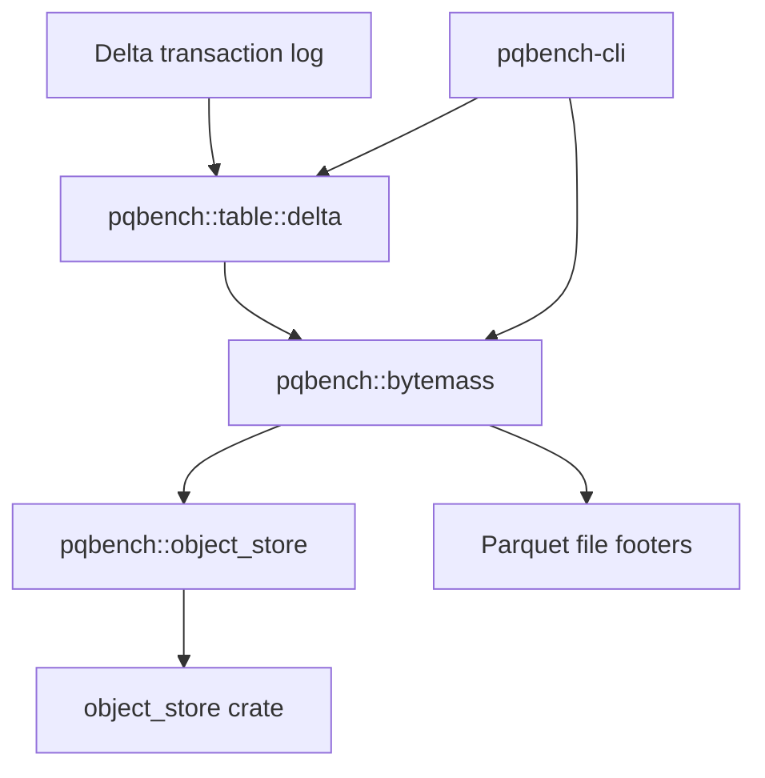

# Delta tables

The `pqbench` library contains an optional Delta Lake table module that resolves
a snapshot and orchestrates footer analysis across its active Parquet files.
Delta dependencies are feature-gated and remain out of the default dependency
graph.



`pqbench` reads metadata from individual Parquet files. The Delta module uses
delta-rs to select a table snapshot and measures each active file through
`bytemass`'s public API, so it does not reach into `bytemass` internals and
names no storage-backend types itself. The only module that names the
`object_store` crate is `pqbench::object_store`, which adapts it to the small
`ObjectReader` interface (`stat` + `read_range`) the rest of the crate uses.

## Usage

Analyze the latest snapshot, or an explicit version, by reading only the active
Parquet files' footer metadata. Enable the feature when building, running, or
testing:

```
cargo run -p pqbench-cli --features delta -- delta ./path/to/table
cargo run -p pqbench-cli --features delta -- delta ./path/to/table --version 3 --json
cargo test -p pqbench --features delta
```

Remote tables are resolved with `delta-s3` (which enables `aws`), and the
active objects are measured through `bytemass::read_remote`:

```
cargo run -p pqbench-cli --features delta-s3 -- delta s3://bucket/table --json
```

## Backends

S3 support is compiled behind the `aws` feature inside `pqbench::object_store`
(the only module that names the `object_store` crate). A URI whose backend is
not compiled in fails at runtime with a message naming the missing feature;
`bytemass` and `pqbench::table::delta` contain no feature flags and no
third-party storage types. Adding another scheme is one arm in the factory plus
one feature.

## Report

The report describes physical storage: active file bytes, physical Parquet rows,
compressed and uncompressed column bytes, codecs, and compressed bytes per row.
It excludes the Delta log and tombstoned files.

## Limitations

The implementation rejects deletion vectors, column mapping, external data
paths, and active files whose size differs from the transaction log. Local path
traversal and symlink escapes are rejected; remote file paths must be relative
to the table root. No partial report is returned on failure.

## Dependencies

Delta resolution delegates to delta-rs 0.32.4, which requires Rust 1.91.1 or
newer. Delta dependencies are only built when the `delta` feature is enabled.
