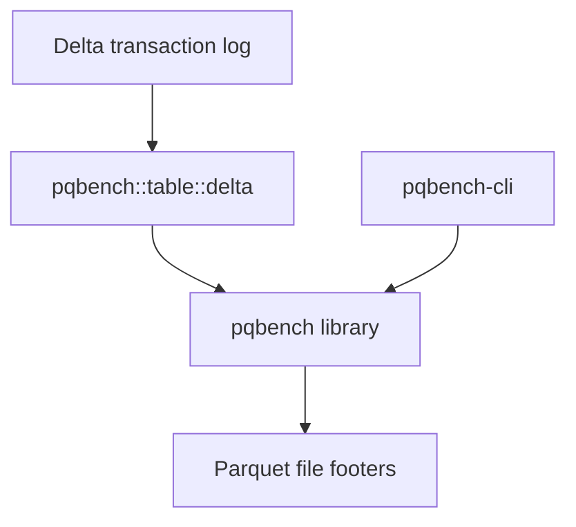

# Delta tables

The `pqbench` library contains an optional Delta Lake table module that resolves
a snapshot and orchestrates footer analysis across its active Parquet files.
Delta dependencies are feature-gated and remain out of the default dependency
graph.



`pqbench` reads metadata from individual Parquet files. The Delta module uses
delta-rs to select a table snapshot, passes each active file to `pqbench`, and
aggregates the results.

## Usage

Analyze the latest snapshot, or an explicit version, by reading only the active
Parquet files' footer metadata. Enable the feature when building, running, or
testing:

```
cargo run -p pqbench-cli --features delta -- delta ./path/to/table
cargo run -p pqbench-cli --features delta -- delta ./path/to/table --version 3 --json
cargo test -p pqbench --features delta
```

## Report

The report describes physical storage: active file bytes, physical Parquet rows,
compressed and uncompressed column bytes, codecs, and compressed bytes per row.
It excludes the Delta log and tombstoned files.

## Limitations

The current local implementation rejects deletion vectors, column mapping,
external data paths, and active files whose size differs from the transaction
log. Path traversal and symlink escapes are rejected, and no partial report is
returned on failure.

## Dependencies

Delta resolution delegates to delta-rs 0.32.4, which requires Rust 1.91.1 or
newer. Delta dependencies are only built when the `delta` feature is enabled.
