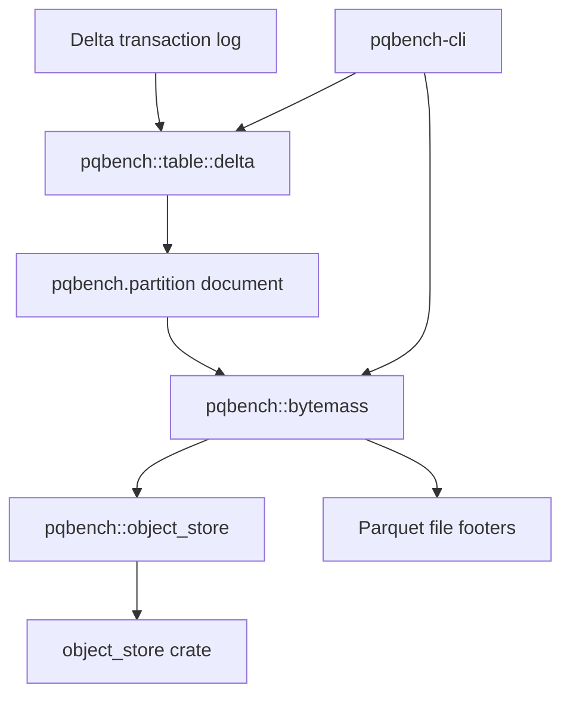

# Delta tables

The `pqbench` library contains an optional Delta Lake table module that detects
a Delta table, reads its transaction log, and names the active Parquet files.
Measurement is a separate step: `pqbench table ls | pqbench partition ls`
emits the files, and `pqbench bytemass` reads them. Delta dependencies are
feature-gated and remain out of the default dependency graph.


```mermaid
flowchart TD
    delta_log[Delta transaction log] --> delta[pqbench::table::delta]
    delta --> document[pqbench.partition document]
    document --> bytemass[pqbench::bytemass]
    bytemass --> isolation[pqbench::object_store]
    isolation --> object_store[object_store crate]
    bytemass --> parquet[Parquet file footers]
    pqbench_cli[pqbench-cli] --> delta
    pqbench_cli --> bytemass
```

`pqbench table ls` names the format before it reads anything. `_delta_log` is
Delta and wins UniForm; Iceberg has its own loader. The Delta module uses
delta-rs to select a table snapshot and names each commit and its active files.
It does not measure footers. The only module that names the `object_store` crate
is `pqbench::object_store`, which adapts it to the small `ObjectReader`
interface (`stat` + `read_range`) the rest of the crate uses.

## Usage

List the table's natural partitions, then their files, then measure them. A
terminal prints the partitions as a table and a summary:

```console run delta
$ pqbench table ls docker/e2e-lakehouse/table --format table
table                          first_time      last_time  commits
--------------------------  -------------  -------------  -------
docker/e2e-lakehouse/table  1789862400000  1789948800000        1
partitions: 1
```

Build with the feature when you run from source, e.g.
`cargo run -p pqbench-cli --features delta -- table ls ./path/to/table`, or run
the same command in a container.

Remote tables are resolved with `delta-s3` (which enables `aws`). Storage
options travel on the document as `env` (`AWS_*` only); they are not written
into the process environment. The cargo command is
`cargo run -p pqbench-cli --features delta-s3 -- table ls s3://bucket/table`.

A producer can supply the table URI and vended credentials as
`pqbench.remote-source`. `table ls` reads the log, and the env travels to
`partition ls` and `bytemass`:

## Backends

S3 support is compiled behind the `aws` feature inside `pqbench::object_store`
(the only module that names the `object_store` crate). A URI whose backend is
not compiled in fails at runtime with a message naming the missing feature.
Adding another scheme is one arm in the factory plus one feature. The `delta`
feature flag gates the loader; its private `delta_helpers` module is the only
code that names the `deltalake` crate and is plain async. `pqbench table ls`
drives a load on a current-thread runtime, so delta-rs selects its own executor
instead of borrowing the caller's.

## Document

`pqbench.partition` version 1 groups a table's commits into an epoch-aligned
commit-time window: `definition` (the window), `commits` (the Delta versions it
holds), and the `env` to read the table's files. `partition ls` re-reads those
commits and emits the files they **added** as `pqbench.table-file` rows (path,
URI, log size), each carrying the env; a file a later commit removes is still
named. `bytemass` measures each file as its line arrives and compares its size
to the log. A terminal prints the files as a table and the summary (file count,
bytes); a pipe streams NDJSON. `--format json` forces the stream, and `-o`
also writes it without delaying stdout:

```console run delta
$ pqbench table ls docker/e2e-lakehouse/table | pqbench partition ls -o /tmp/partition.ndjson.zst
$ pqbench bytemass /tmp/partition.ndjson.zst --format table
column  type        codec   encodings                 bytes  values
------  ----------  ------  ------------------------  -----  ------
id      INT64       SNAPPY  PLAIN,RLE,RLE_DICTIONARY     66       3
label   BYTE_ARRAY  SNAPPY  PLAIN,RLE,RLE_DICTIONARY     72       3
files: 1
rows: 3
columns: 2
```

## Memory use

With NDJSON output, `table ls` emits each partition and `partition ls` each
available active file without retaining a second complete history or file list
in the CLI. Output writes are awaited, so a slow consumer slows the producer.

A metadata-only caller asks for the header with `LoadRequest::without_files()`:
delta-rs skips the active-file replay, and the load reports the snapshot
version, schema, partition columns, and properties at O(1) in files.
`pqbench table info` is that caller.

Delta-rs still loads its active-file snapshot before the first record. Its lazy
file stream in the pinned version rejects malformed optional statistics that
the existing loader tolerates, so it is not a compatible replacement yet.
Memory also includes the largest individual commit and per-partition totals;
human table output buffers rows to align columns. All available JSON history
is still read. The library API retains the log and files it reads.

## Limitations

Data paths must stay inside the table root (no URIs, no `..`). A missing
`delta` feature fails at runtime and names the feature. Iceberg is detected
from `metadata/version-hint.text` or `metadata/*.metadata.json` and has its own
loader ([docs/iceberg.md](iceberg.md)).

## Dependencies

Delta resolution delegates to delta-rs 0.32.4, which requires Rust 1.91.1 or
newer. Delta dependencies are only built when the `delta` feature is enabled.
