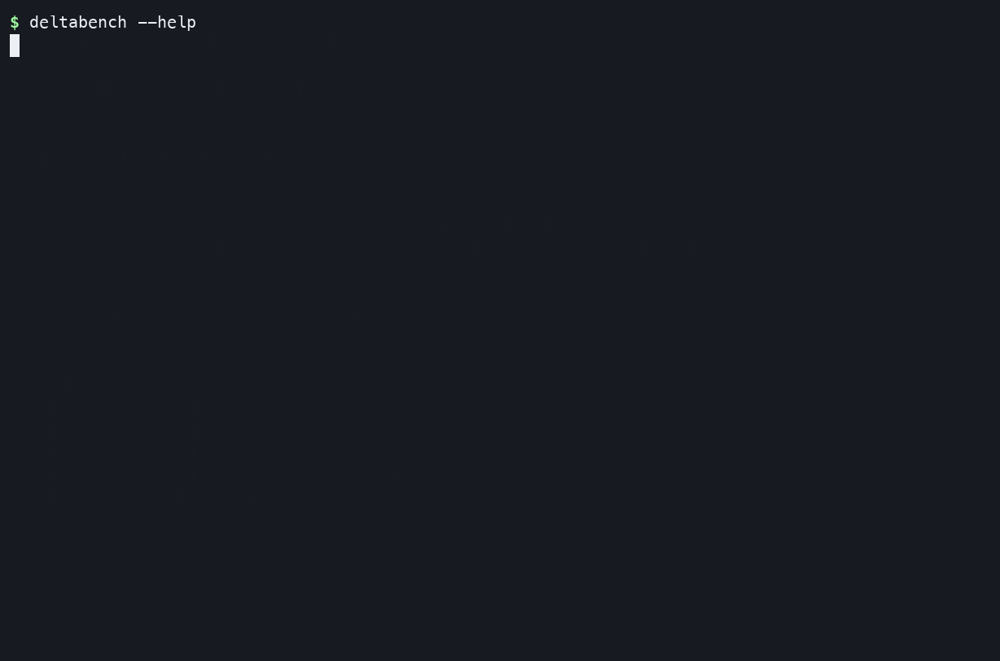
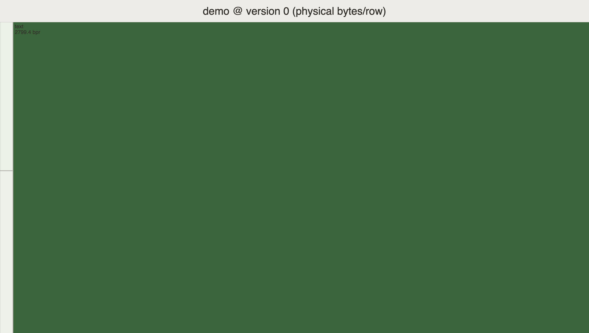

# Visual demos

These examples use real public datasets:

- **Single Parquet file:** [NYC TLC yellow-taxi trips for January 2024](https://d37ci6vzurychx.cloudfront.net/trip-data/yellow_tripdata_2024-01.parquet).
- **Delta table:** [Daft's small Stack Exchange sample](https://daft-public-datasets.s3.us-west-2.amazonaws.com/red-pajamas/stackexchange-sample-north-germanic-deltalake/)
  with Danish, Norwegian, and Swedish partitions.

The terminal recordings show discovery through `--help`, normal text output,
JSON output, glob or snapshot selection, and D3 export. The screenshots show the
resulting compressed-byte-mass treemaps.

## pqbench: one Parquet file

```sh
pqbench bytemass yellow_tripdata_2024-01.parquet
pqbench bytemass 'yellow_tripdata_*.parquet' --json
pqbench bytemass yellow_tripdata_2024-01.parquet --d3 > treemap.html
```


The treemap area represents each column's compressed bytes per physical row:


## deltabench: one Delta snapshot

```sh
deltabench ./stackexchange-delta
deltabench ./stackexchange-delta --version 0 --json
deltabench ./stackexchange-delta --d3 > treemap.html
```



The table-level treemap aggregates the active Parquet files selected by the
Delta transaction log:



## Regenerate the terminal recordings

Stage the datasets under `.docker-data/` as documented in
[AGENTS.md](../AGENTS.md), install `asciinema` and `agg`, then run:

```sh
docs/demos/record.sh
```

The script detects the Docker daemon's native ARM64 or AMD64 architecture and
uses persistent, architecture-specific Cargo volumes.
