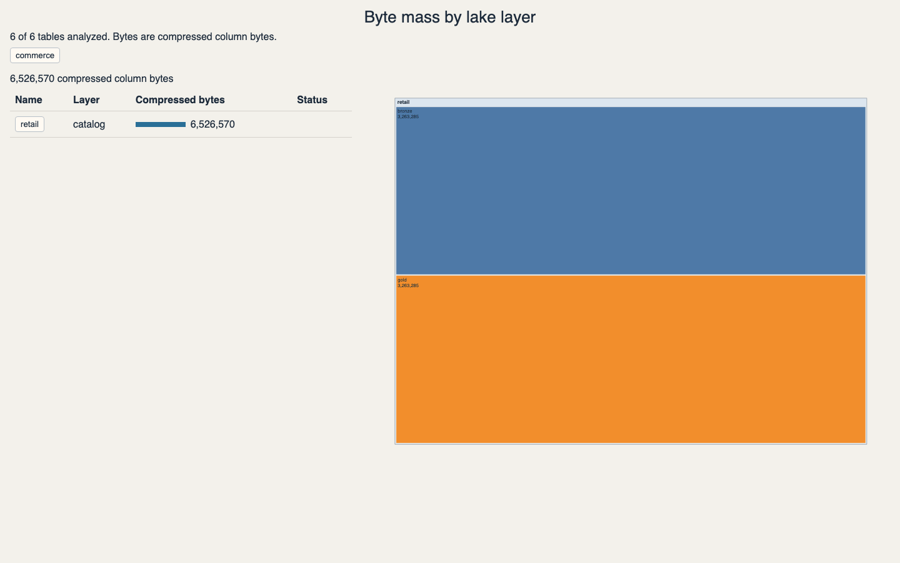
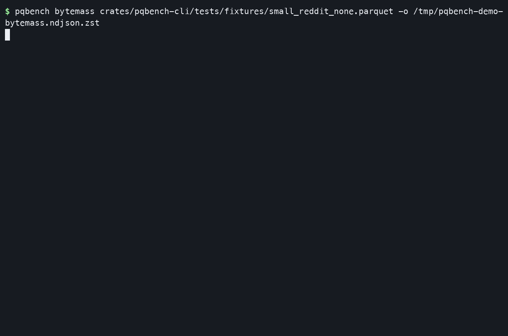
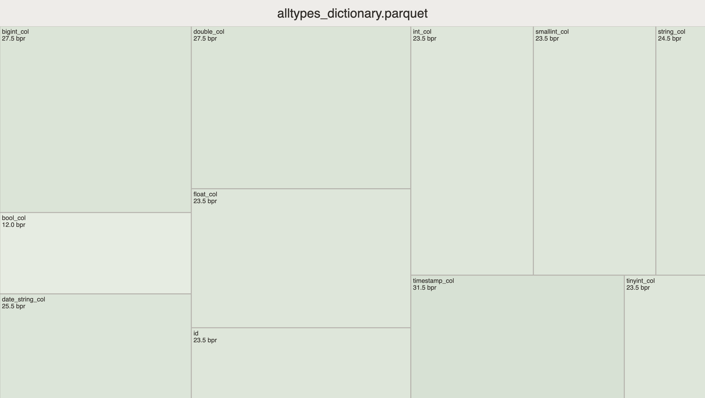
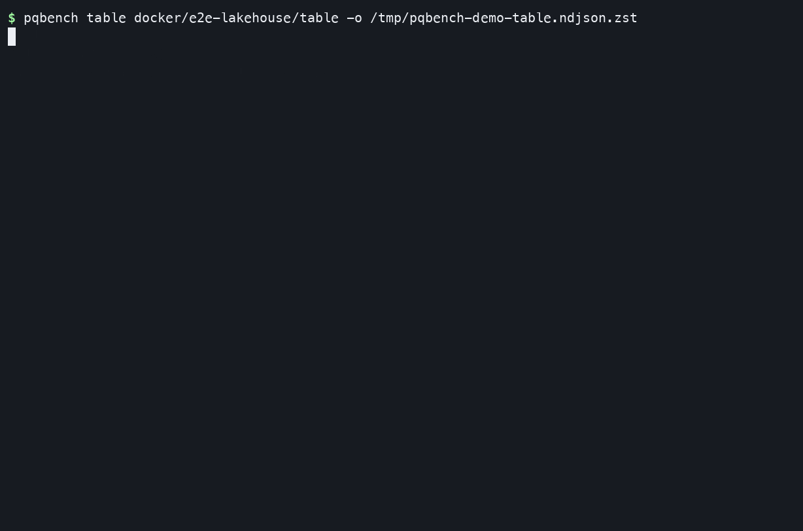
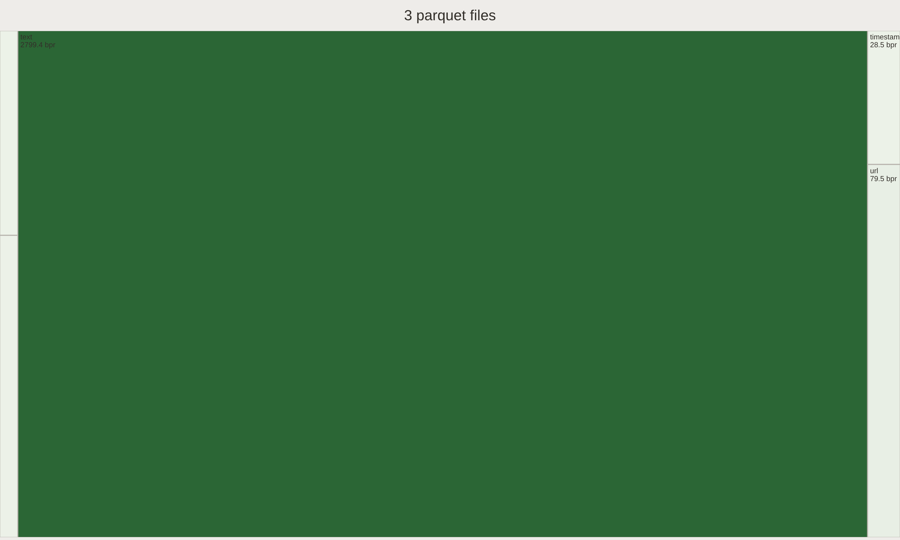

# Visual demos

pqbench measures Parquet footers. A file is one input. A table is a snapshot
of files. The pipe is the same in every case:

```console run
$ pqbench bytemass examples/quickstart.parquet --format table
column  type   codec         encodings                 bytes  values
------  -----  ------------  ------------------------  -----  ------
id      INT64  UNCOMPRESSED  PLAIN,RLE,RLE_DICTIONARY    102       8
year    INT32  UNCOMPRESSED  PLAIN,RLE,RLE_DICTIONARY     68       8
files: 1
rows: 8
columns: 2
$ pqbench bytemass examples/quickstart.parquet | pqbench viz -o /tmp/report
```

A terminal prints an aligned table; a pipe streams NDJSON (`pqbench.partition`,
`pqbench.table-file`, `pqbench.bytemass-row`). `--format json` forces the
stream, and `-o` also writes it. `pqbench viz` collects the bytemass stream into
a static HTML treemap.

The walkthroughs use the committed lakehouse fixtures under
[`docker/e2e-lakehouse/`](../docker/e2e-lakehouse) and the small Parquet
fixture in the test suite. Catalog pipes need `make lakehouse`.

## Selecting files with Unix tools

`bytemass` measures the files the `partition ls` stream names; which files is a
shell decision. The stream is one JSON record per line, so `jq` prunes file
records by `path`, and `sort`, `head`, or `awk` sample by name:

```console run delta json
# one file: keep only the part-* records
$ pqbench table ls docker/e2e-lakehouse/table \
>   | pqbench partition ls \
>   | jq -c 'select(.path | startswith("part-"))' \
>   | pqbench bytemass --json | tail -1
{"kind":"pqbench.bytemass","event":"end","file_count":1,"row_count":3,"column_count":2}

# first N by path: sort the file URIs, cap them, then measure
$ pqbench table ls docker/e2e-lakehouse/table \
>   | pqbench partition ls \
>   | jq -r 'select(.kind == "pqbench.table-file") | .uri' \
>   | sort | head -10 \
>   | xargs pqbench bytemass --json | tail -1
{"kind":"pqbench.bytemass","event":"end","file_count":1,"row_count":3,"column_count":2}

# every Nth file
$ pqbench table ls docker/e2e-lakehouse/table \
>   | pqbench partition ls \
>   | jq -r 'select(.kind == "pqbench.table-file") | .uri' \
>   | awk 'NR % 2 == 1' \
>   | xargs pqbench bytemass --json | tail -1
{"kind":"pqbench.bytemass","event":"end","file_count":1,"row_count":3,"column_count":2}
```

The `partition ls` stream keeps each file's `env` (S3/Unity credentials) on the
record, so the first form works for remote tables. Dropping to bare `uri`s
(`jq -r`) is local-only: pass credentials in the environment when you use
`xargs`.

## A table's partitions

`table ls` groups a table's commits into epoch-aligned commit-time windows;
`partition ls` re-reads each window's commits and names the files they added.
The whole walk is three commands:

```console run delta
$ pqbench table ls docker/e2e-lakehouse/table -o /tmp/partition.ndjson.zst
$ pqbench table ls docker/e2e-lakehouse/table | pqbench partition ls | pqbench bytemass | pqbench viz -o /tmp/report
```



```console run delta
$ pqbench table ls docker/e2e-lakehouse/table | pqbench partition ls | pqbench bytemass --format table
column  type        codec   encodings                 bytes  values
------  ----------  ------  ------------------------  -----  ------
id      INT64       SNAPPY  PLAIN,RLE,RLE_DICTIONARY     66       3
label   BYTE_ARRAY  SNAPPY  PLAIN,RLE,RLE_DICTIONARY     72       3
files: 1
rows: 3
columns: 2
```

## Catalogs

A `pqbench.lake-source` names a catalog. `GET /v1/config` with a `defaults`
object is Iceberg REST; a 200 without `defaults`, or HTTP 404, is Unity. The
walk descends `metastore ls` → `catalog ls` → `schema ls`, checks and vends
credentials, then enriches each table and lists its files:

```console no-run
$ export PQB_ENDPOINT=… PQB_TOKEN=…
$ pqbench schema ls CAT.SCHEMA |
    pqbench credentials check |
    pqbench credentials get |
    pqbench tablev2 info |
    pqbench table ls |
    pqbench partition ls |
    pqbench bytemass --format table
```

Every stage of a pipe writes NDJSON for the next stage; the last one prints the
table (`--format table`). The committed `docs/demos/unity.json` and
`docs/demos/iceberg-rest.json` point at the local stand (`make lakehouse`). See
[docker/e2e-lakehouse/README.md](../docker/e2e-lakehouse/README.md).

## One Parquet file

```console run
$ pqbench bytemass crates/pqbench-cli/tests/fixtures/small_reddit_none.parquet -o /tmp/bytemass.ndjson.zst
$ pqbench bytemass crates/pqbench-cli/tests/fixtures/small_reddit_none.parquet --format table
column            type        codec         encodings                  bytes  values
----------------  ----------  ------------  ------------------------  ------  ------
text              BYTE_ARRAY  UNCOMPRESSED  PLAIN,RLE,RLE_DICTIONARY  743566    3000
label             BYTE_ARRAY  UNCOMPRESSED  PLAIN,RLE,RLE_DICTIONARY    2469    3000
dataType          BYTE_ARRAY  UNCOMPRESSED  PLAIN,RLE,RLE_DICTIONARY     360    3000
communityName     BYTE_ARRAY  UNCOMPRESSED  PLAIN,RLE,RLE_DICTIONARY    2468    3000
datetime          BYTE_ARRAY  UNCOMPRESSED  PLAIN,RLE,RLE_DICTIONARY      87    3000
username_encoded  BYTE_ARRAY  UNCOMPRESSED  PLAIN,RLE,RLE_DICTIONARY  446197    3000
url_encoded       BYTE_ARRAY  UNCOMPRESSED  PLAIN,RLE,RLE_DICTIONARY  907117    3000
files: 1
rows: 3000
columns: 7
```





## One Delta snapshot

`pqbench table ls` needs `--features delta` to read a log. A terminal prints the
partitions as a table; a pipe streams NDJSON for `partition ls` and `bytemass`:

```console run delta
$ pqbench table ls docker/e2e-lakehouse/table | pqbench partition ls -o /tmp/partition.ndjson.zst
$ pqbench table ls docker/e2e-lakehouse/table | pqbench partition ls | pqbench bytemass --format table
column  type        codec   encodings                 bytes  values
------  ----------  ------  ------------------------  -----  ------
id      INT64       SNAPPY  PLAIN,RLE,RLE_DICTIONARY     66       3
label   BYTE_ARRAY  SNAPPY  PLAIN,RLE,RLE_DICTIONARY     72       3
files: 1
rows: 3
columns: 2
$ pqbench table ls docker/e2e-lakehouse/table | pqbench partition ls | pqbench bytemass | pqbench viz -o /tmp/report
```





## One Iceberg snapshot

Iceberg needs `--features iceberg` (`iceberg-s3` for `s3://`). The committed
fixture stores data as `s3://lakehouse/...`, so measure it through the stand
(`make lakehouse`), not just the feature:

```console no-run
$ pqbench table ls docker/e2e-lakehouse/iceberg -o /tmp/iceberg.ndjson.zst
```

With the stand up, walk the Iceberg REST catalog (`docs/demos/iceberg-rest.json`)
and measure through it: `schema ls | credentials check | credentials get |
tablev2 info | table ls | partition ls | bytemass`.
`docs/demos/pqbench-iceberg-session.sh` runs the REST pipe when the stand answers
at `localhost:8181`.

## Regenerate the terminal recordings

Install `asciinema` and `agg`, then:

```sh
docs/demos/record.sh
```

That builds `pqbench` with `--features delta` (honoring `CARGO_TARGET_DIR`)
and records the Parquet and Delta sessions against committed fixtures.
The Iceberg REST pipe is not recorded here; it needs `make lakehouse`.

The table treemap GIF is one still of the viz page. Recapture it with
`docs/demos/capture-lake-treemap.sh` (Chrome + `ffmpeg`).
