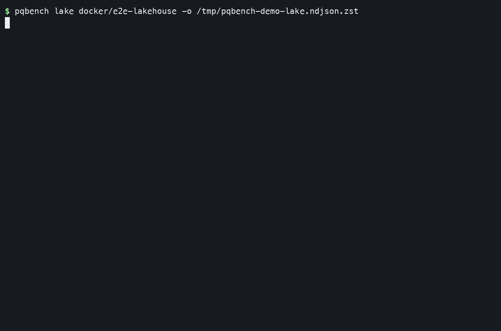

# Visual demos

pqbench measures Parquet footers. A file is one input. A table is a snapshot
of files. A lake is a list of tables. The pipe is the same in every case:

```sh
pqbench bytemass data.parquet
pqbench table ./delta-table | pqbench bytemass
pqbench table ./iceberg-table | pqbench bytemass
pqbench lake ./warehouse | pqbench table | pqbench bytemass | pqbench viz -o report
```

A terminal prints an aligned table; a pipe streams NDJSON
(`pqbench.table-ref`, `pqbench.table` begin/file/end, `pqbench.bytemass-row`).
`--format json` forces the stream, and `-o` also writes it.
`pqbench viz` collects the bytemass stream into a static HTML treemap.

The walkthroughs use the committed lakehouse fixtures under
[`docker/e2e-lakehouse/`](../docker/e2e-lakehouse) and the small Parquet
fixture in the test suite. Catalog pipes need `make lakehouse`.

## Selecting files with Unix tools

`bytemass` measures the files the `table` stream names; which files is a shell
decision. The stream is one JSON record per line, so `jq` prunes file records
by `path`, and `sort`, `head`, or `awk` sample by name:

```console run delta
# one file: keep the begin/end records, drop the file records
$ pqbench table docker/e2e-lakehouse/table \
>   | jq -c 'select(.kind != "pqbench.table-file" or (.path | startswith("part-")))' \
>   | pqbench bytemass --json | tail -1
{"kind":"pqbench.bytemass","event":"end","file_count":1,"row_count":3,"column_count":2}

# first N by path: sort the file URIs, cap them, then measure
$ pqbench table docker/e2e-lakehouse/table \
>   | jq -r 'select(.kind == "pqbench.table-file") | .uri' \
>   | sort | head -10 \
>   | xargs pqbench bytemass --json | tail -1
{"kind":"pqbench.bytemass","event":"end","file_count":1,"row_count":3,"column_count":2}

# every Nth file
$ pqbench table docker/e2e-lakehouse/table \
>   | jq -r 'select(.kind == "pqbench.table-file") | .uri' \
>   | awk 'NR % 2 == 1' \
>   | xargs pqbench bytemass --json | tail -1
{"kind":"pqbench.bytemass","event":"end","file_count":1,"row_count":3,"column_count":2}
```

The first form keeps the per-table `env` (S3/Unity credentials) on the begin
record, so it works for remote tables. Dropping to bare `uri`s (`jq -r`) is
local-only: pass credentials in the environment when you use `xargs`.

The same filtered stream copies the selected files to disk with `dump`, keeping
each table-relative path:

```console run delta
$ pqbench table docker/e2e-lakehouse/table \
>   | jq -c 'select(.kind != "pqbench.table-file" or (.path | startswith("part-")))' \
>   | pqbench dump /tmp/sample
dump: 1 file(s), 796 bytes -> /tmp/sample
```

## A lake of tables

A directory, `file://` URI, or `s3://` prefix is walked until a table marker
that `pqbench table` also accepts. Children of a table are not searched.

```console run delta
$ pqbench lake docker/e2e-lakehouse -o /tmp/lake.ndjson.zst
$ pqbench lake docs/demos/lake.json | pqbench table | pqbench bytemass | pqbench viz -o /tmp/report
```



[docs/demos/lake.json](demos/lake.json) names the Unity Delta fixture so the
full `lake | table | bytemass` pipe works without rustfs. The Iceberg fixture
in the same tree lists; measuring it needs the stand (`iceberg-s3`).

`--json` is the same NDJSON stream. For a treemap, pipe bytemass to `viz`.
The image is one still of that page, not a lake click-through:


```console run delta
$ pqbench table docker/e2e-lakehouse/table | pqbench bytemass | pqbench viz -o /tmp/report
```

## Catalogs

A `pqbench.lake-source` lists a catalog. `GET /v1/config` with a `defaults`
object is Iceberg REST; a 200 without `defaults`, or HTTP 404, is Unity.

```sh
pqbench lake docs/demos/unity.json | pqbench table | pqbench bytemass
pqbench lake docs/demos/iceberg-rest.json | pqbench table | pqbench bytemass
```

Those documents point at the local stand. See
[docker/e2e-lakehouse/README.md](../docker/e2e-lakehouse/README.md).

## One Parquet file

```console run
$ pqbench bytemass crates/pqbench-cli/tests/fixtures/small_reddit_none.parquet -o /tmp/bytemass.ndjson.zst
$ pqbench bytemass crates/pqbench-cli/tests/fixtures/small_reddit_none.parquet --json | tail -1
{"kind":"pqbench.bytemass","event":"end","file_count":1,"row_count":3000,"column_count":7}
$ pqbench bytemass crates/pqbench-cli/tests/fixtures/small_reddit_none.parquet | pqbench viz -o /tmp/report
```


## One Delta snapshot

`pqbench table` needs `--features delta` to load a log. A terminal prints the
active files as a table; a pipe streams NDJSON for `bytemass`:

```console run delta
$ pqbench table docker/e2e-lakehouse/table -o /tmp/table.ndjson.zst
$ pqbench table docker/e2e-lakehouse/table | pqbench bytemass | tail -1
{"kind":"pqbench.bytemass","event":"end","file_count":1,"row_count":3,"column_count":2}
$ pqbench table docker/e2e-lakehouse/table | pqbench bytemass | pqbench viz -o /tmp/report
```


## One Iceberg snapshot

Iceberg needs `--features iceberg` (`iceberg-s3` for `s3://`). The committed
fixture stores data as `s3://lakehouse/...`, so measure it through the stand:

```sh
pqbench lake docker/e2e-lakehouse/iceberg -o iceberg.ndjson.zst
pqbench lake docs/demos/iceberg-rest.json | pqbench table | pqbench bytemass
```

`docs/demos/pqbench-iceberg-session.sh` lists the fixture; set
`PQBENCH_LAKEHOUSE=1` when the stand is up to run the REST pipe.

## Regenerate the terminal recordings

Install `asciinema` and `agg`, then:

```sh
docs/demos/record.sh
```

That builds `pqbench` with `--features delta` (honoring `CARGO_TARGET_DIR`)
and records the lake, Parquet, and Delta sessions against committed fixtures.
The Iceberg REST pipe is not recorded here; it needs `make lakehouse`.

The table treemap GIF is one still of the viz page. Recapture it with
`docs/demos/capture-lake-treemap.sh` (Chrome + `ffmpeg`).
