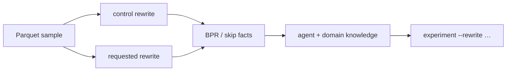

# Experiment: rewrite a dump and measure it

`profile` reports facts. `pqbench experiment` applies a requested rewrite
to the same sample and measures the rewritten Parquet. Build empirical
verification early rather than attempting to perfectly predict
compression.

```sh
pqbench dump data.parquet | pqbench experiment --rewrite sort:ts --aim skipping
pqbench experiment sample.parquet --rewrite 'sort:country,city' --rewrite 'zorder:lat,lon' --aim all
pqbench experiment sample.parquet --rewrite codec:snappy --rewrite 'dictionary:off'
```

A pipe streams NDJSON. A TTY needs `-o`.



## `--aim`

| Aim | What is compared |
| --- | --- |
| `storage` (default) | file bytes, bytes per row, per-column compressed mass versus control |
| `skipping` | row-group min/max locality (`skip_span_ratio`, `skip_point_equal_fraction`) |
| `all` | both |

`--aim skipping` splits the sample into several row groups unless a
trial sets `row-group-size`. A single row group cannot show skip
locality.

The **control** trial is always written first: same writer defaults
(zstd, dictionary on), no layout change. Ratios are versus that
control, not versus the source file's original encodings.

## `--rewrite SPEC`

Each `--rewrite` (or `--trial`) is one trial. Semicolons compose
rewrites in that trial.

| Spec | Effect |
| --- | --- |
| `sort:A` / `sort:A,B` / `sort:A,B,C` | row order |
| `zorder:A,B` | Morton order on value ranks |
| `hilbert:A,B` | 2-D Hilbert order (exactly two columns) |
| `codec:zstd@3` | `uncompressed`, `snappy`, `gzip`, `lz4`, `zstd` |
| `dictionary:on` / `off` / `BYTES` | dictionary page on, off, or size limit |
| `encoding:plain` | also `delta`, `rle`, `delta_length`, `delta_byte_array`, `byte_stream_split` |
| `page-size:BYTES` | data-page size limit |
| `row-group-size:ROWS` | rows per row group |
| `cast:COL:int64` | also `double`, `string` |
| `drop:COL` | drop a column before write |

`--indexes` also loads page-index counts from the rewritten footer.

## What this command does not do

It does not recommend a sort key, codec, or page size. Those belong to
`pqbench skill parquet-advisor` after looking at `profile` facts and
these trial rows. Footer masses of an existing file stay on
`pqbench bytemass`.
