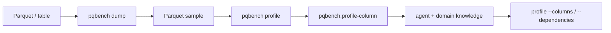

# Profile a dump sample

`dump` writes a Parquet sample. `pqbench profile` decodes those rows and
emits sample-level facts. Measurement stays cheap by default so an agent
can look at the stream, add domain knowledge, and only then spend budget
on `--columns` or `--dependencies`.

```sh
pqbench dump data.parquet | pqbench profile
pqbench profile sample.parquet --columns 'device*'
pqbench profile sample.parquet --columns country --columns city --dependencies
```

A pipe streams NDJSON. A TTY needs `-o`.



## Default (cheap)

One pass plus a sort of the sample, per column. `--rows first:8192`
stops decode so a full file does not become a scan. `--columns` keeps
named columns for the next pass.

Each `pqbench.profile-column` line carries:

- NDV, NDV ratio, null fraction, entropy, singleton count
- top values; full `frequency` when NDV ≤ 32
- numeric min/max/range, mean/stddev/skew, quantiles
- adjacent absolute-delta mean/p50/p90/p99/max and zero fraction
- string length mean/min/p50/p90/p99/max, common prefix/suffix,
  adjacent prefix
- alphabet fractions (ASCII, digit, letter, hex, whitespace) and
  unique code points
- adjacent equality, run-length mean/p50/p90/p99/max, monotonicity
- observed patterns: `uuid`, `integer_string`, `decimal_string`,
  `timestamp_string`, `ip`, `url`, `json`, `enum_like`

Nested structs explode to `parent.child` leaves. Lists add
`name.list_length` and `name.first` (then explode if that value is a
struct). Maps with more than 32 keys stay as `name.map_length`.

The begin record lists `capabilities` so a caller does not have to
memorize flags.

## `--dependencies` (medium)

Pairwise facts, `O(columns² · rows)`, off by default. Narrow with
`--columns` first.

Each `pqbench.profile-dependency` line carries joint NDV, entropies,
mutual information, and functional-dependency strength.

## What this command does not do

It does not recommend codecs, sort keys, or data-skipping settings.
Those belong to a later pass that reads these facts plus the caller's
prompt. Footer byte masses stay on `pqbench bytemass` (no value decode).
