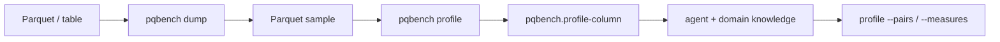

# Profile a dump sample

`dump` writes a Parquet sample. `pqbench profile` decodes those rows and
emits sample-level facts. Measurement stays cheap by default so an agent
can look at the stream, add domain knowledge, and only then spend budget
on `--columns`, `--pairs`, `--measures`, or `--dependencies`.

```sh
pqbench dump data.parquet | pqbench profile
pqbench profile sample.parquet --columns 'device*'
pqbench profile sample.parquet --columns country --columns city --dependencies
pqbench profile sample.parquet --pairs country,city --measures functional_dependency
pqbench profile sample.parquet --measures null_cooccurrence --measures categorical_association
```

A pipe streams NDJSON. A TTY needs `-o`.



## Default (cheap)

One pass plus a sort of the sample, per column. `--rows first:8192`
stops decode so a full file does not become a scan. `--columns` keeps
named columns for the next pass.

Each `pqbench.profile-column` line carries:

- NDV, NDV ratio, null fraction, entropy, singleton count
- top values; full `frequency` when NDV ≤ 32
- numeric min/max/range, mean/stddev/skew, quantiles
- adjacent absolute-delta mean/p50/p90/p99/max and zero fraction
- string length mean/min/p50/p90/p99/max, common prefix/suffix,
  adjacent prefix
- alphabet fractions (ASCII, digit, letter, hex, whitespace) and
  unique code points
- adjacent equality, run-length mean/p50/p90/p99/max, monotonicity
- observed patterns: `uuid`, `integer_string`, `decimal_string`,
  `timestamp_string`, `ip`, `url`, `json`, `enum_like`

Nested structs explode to `parent.child` leaves. Lists add
`name.list_length` and `name.first` (then explode if that value is a
struct). Maps with more than 32 keys stay as `name.map_length`.

The begin record lists `capabilities` so a caller does not have to
memorize flags.

## `--dependencies` (medium, locality)

Pairwise facts, `O(pairs · rows)`, off by default. This is
dependency / locality analysis — not a Pearson-only correlation
sweep. Pearson misses categorical dependencies and most of the
signals that matter for compression.

`--pairs LEFT,RIGHT` (repeatable) and `--measures NAME` (repeatable)
are the request surface. Either implies `--dependencies`. Valid
measures: `pair_ndv`, `entropy`, `mutual_information`,
`functional_dependency`, `null_cooccurrence`,
`numeric_relationship`, `categorical_association`, `all`.

Without `--pairs`, a narrow `--columns` list is paired as requested.
Otherwise L0 footer byte mass (from the sample) plus L2 column facts
select at most eight promising columns before pairing. Unique-like
IDs (high NDV ratio, no heavy mass) are dropped.

Each `pqbench.profile-dependency` line can carry:

- NDV(A), NDV(B), NDV(A,B), mean/max conditional NDV
- H(A), H(B), H(A,B), H(B|A), H(A|B)
- mutual information and normalized mutual information
- functional-dependency strength both ways
- null co-occurrence (2×2 counts and Jaccard)
- numeric relationship (Pearson, Spearman, same-sign deltas)
- categorical association (Cramér's V)

The begin record's `locality` object names the selection
(`requested` or `promising`), the columns that entered the pairwise
pass, and the measures that were computed.

## What this command does not do

It does not recommend codecs, sort keys, or data-skipping settings.
Those belong to `pqbench experiment`, which rewrites the sample and
measures bytes per row or skip locality. Footer byte masses stay on
`pqbench bytemass` (no value decode).
