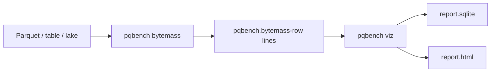

# Visualize a bytemass stream

`bytemass` measures Parquet footers and writes NDJSON. `pqbench viz` collects
those lines into SQLite and a static HTML page. Measurement and presentation
are separate commands so either end can change without the other.

```sh
pqbench bytemass data.parquet | pqbench viz -o report
pqbench table ./delta-table | pqbench bytemass | pqbench viz -o report
pqbench lake ./warehouse | pqbench table | pqbench bytemass | pqbench viz -o report
xdg-open report.html
```

`-o report` writes `report.sqlite` and `report.html`. A terminal prints a
short summary. The HTML file embeds the database; open it without a server.



## Stream

Each measured column is one line:

```json
{"kind":"pqbench.bytemass-row","id":"sales/orders","file":"part-0.parquet","size":1200,"num_rows":3000,"column":"text","compressed_bytes":80,"uncompressed_bytes":240,"codec":"ZSTD"}
```

`id` is the table the file belongs to, or empty for a bare parquet path.
`viz` does not reread the files.

## SQLite

`masses` is one row per column chunk:

| column | meaning |
| --- | --- |
| `id` | table id from the stream |
| `file` | input path or URI |
| `size` | on-disk file size |
| `num_rows` | rows in the file |
| `column_path` | schema path (`text`, `a.b`) |
| `compressed_bytes` | on-disk bytes for the chunk |
| `uncompressed_bytes` | encoded bytes before compression |
| `codec` | codec recorded in the footer |

```sh
sqlite3 report.sqlite 'SELECT column_path, SUM(compressed_bytes) FROM masses GROUP BY column_path'
```

## HTML

The page loads [sql.js](https://sql.js.org) and the d3 modules it uses
(hierarchy, scale, selection) from a CDN. JavaScript opens the embedded
SQLite file, groups rows by `id`, and draws a treemap of on-disk bytes per
row. Several tables become a list plus one treemap each. No build step, no
npm, no local server.
