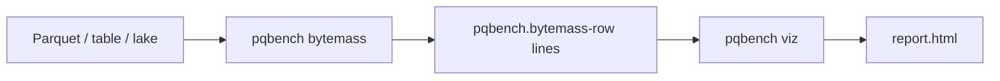

# Visualize a bytemass stream

`bytemass` measures Parquet footers and writes NDJSON. `pqbench viz` collects
those lines into a static HTML page. Measurement and presentation are separate
commands so either end can change without the other.

```sh
pqbench bytemass data.parquet | pqbench viz -o report
pqbench table ./delta-table | pqbench bytemass | pqbench viz -o report
pqbench lake ./warehouse | pqbench table | pqbench bytemass | pqbench viz -o report
xdg-open report.html
```

`-o report` writes `report.html`. A terminal prints a short summary. The HTML
file embeds the measured rows; open it without a server.



## Stream

Each measured column is one line:

```json
{"kind":"pqbench.bytemass-row","id":"sales/orders","file":"part-0.parquet","size":1200,"row_count":3000,"column":"text","compressed_bytes":80,"uncompressed_bytes":240,"codec":"ZSTD"}
```

`id` is the table the file belongs to, or empty for a bare parquet path.
`viz` does not reread the files.

## HTML

The page embeds the rows as JSON and loads the d3 modules it uses (hierarchy,
scale, selection) from a CDN. JavaScript groups rows by `id`, sums
`compressed_bytes` per column path, and draws a treemap of on-disk bytes per
row. Several tables become a list plus one treemap each. No build step, no
npm, no local server.
